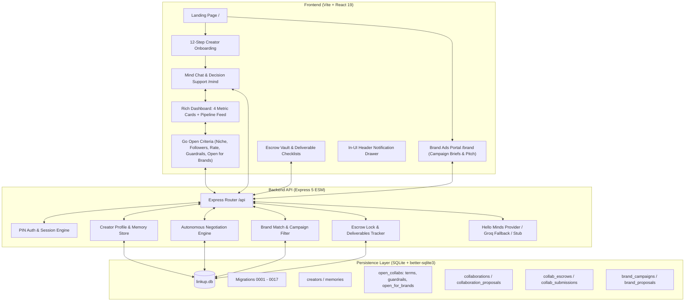

# LINKUP — Creator & Brand Autonomous Collaboration Platform

Built for the **Minds AI Hackathon** — an AI-managed creator-to-creator collaboration and brand sponsorship matching network where each creator and brand operates through an autonomous, persistent **Mind**.

---

## 🌟 Vision & Core Concept

1. **Every Creator has a Personal Mind**:
   - Onboarded via personal background, content niche, platform metrics, and non-negotiable boundaries.
   - The Mind remembers past interactions, acts as a personal decision-support advisor, and negotiates terms autonomously on the creator's behalf.
2. **Autonomous Negotiation (Mind-to-Mind & Brand-to-Mind)**:
   - Minds handle the multi-round back-and-forth negotiation (`Draft` → `Countering` → `Agreed` / `Paused`).
   - Humans only step in to set guardrails and sign off on the final agreement (or use the **"Take Over"** button to chat directly).
3. **Escrow Vault & Quality Protection**:
   - 2-Party Signatures lock the collaboration deal into an escrow state.
   - Deliverable submission checklists verify live content links before auto-releasing funds, with integrated Quality Dispute routing.
4. **Brand Ads Portal (`/brand`)**:
   - Dedicated portal for commercial advertisers and sponsors to publish campaign briefs (Niche, Follower Floor, Target Avg Views, Content Type, Language, Budget).
   - Direct connection to creators who enable **"⚡ Open for Brands too"** in their **Go Open** settings.

---

## 🏗 Full Architecture & System Diagram



---

## 🧩 Key Subsystems

### 1. Go Open Form (Matching Criteria)
Creators publish real-time matching parameters:
- **Primary Platform & Followers**: Dropdown (`Instagram`, `YouTube`, `TikTok`, `Twitch`, `X`, `Other`) + follower floor.
- **Niche & Category**: Dropdown (Tech & AI, Gaming, Music, Fashion, Lifestyle, Education, etc.).
- **Min Rate & Collab Types**: Multi-select (`Paid`, `Barter`, `Affiliate`, `UGC`).
- **Availability Window**: Date range selector.
- **⚡ Open for Brands too**: Toggle allowing brands to discover the creator in the Brand Portal, with custom minimum sponsorship ad rates.
- **Non-Negotiable Guardrails**: Hard limits that the AI Mind is strictly prohibited from conceding on during negotiations.

### 2. Autonomous Deal Pipeline & Dashboard
- **4 Metric Cards**:
  - `Active Negotiations` (AI-to-AI counters in progress)
  - `Pending Sign-offs ⚠️` (Emphasized alert for deals awaiting human signature)
  - `Completed Collabs` (Escrow auto-released)
  - `New Matches` (Threshold-compatible creators)
- **Negotiation Feed**: Live deal rows with stage badges (`Draft`, `Countering`, `Agreed`), AI proposal summaries, `Transcript`, `Take Over ✋`, and `Escrow Vault 🔒`.
- **Recent Activity Audit Trail**: Chronological log of matches, counters, and boundary conflict checks.

### 3. Own-Mind Chat Box
- Header avatar monogram, online status indicator (`● Online & Ready for Decision Support`).
- Message thread with timestamps and "Save to Mind" memory capture.
- `⚡ Quick Prompts ▾` menu (*"Which deal is best for me right now?"*, *"Show my current negotiations"*, *"What are my non-negotiable guardrails?"*).

### 4. Brand Ads Portal (`/brand`)
- **Campaign Specs Builder**: Brand Name, Campaign Title, Target Niche, Platform, Min Followers, Target Avg Views, Content Ad Format (Dedicated Reel, YouTube Integration, Full Video, UGC Creative), Language, and Budget per Creator ($).
- **Matching Creator Feed**: Real-time filtered grid of creators matching the brand's criteria with instant one-click **"Send Sponsorship Offer ⚡"** dispatching proposals to the creator's Mind.

### 5. Agreement & Escrow Demo Flow
- Complete workflow: **Match → AI Negotiation → 2-User Signature → Escrow Lock → Deliverable Link Submissions → Auto-Release / Quality Dispute Flag**.

---

## 🛠 Tech Stack

| Layer | Choice |
| --- | --- |
| **Frontend** | Vite, React 19 (TypeScript, strict), CSS Custom Properties (Editorial Brutalist design) |
| **Backend** | Express 5 (TypeScript, strict ESM), Hello Minds Provider Adapter |
| **Database** | SQLite via `better-sqlite3`, 17 hand-rolled migrations |
| **Testing** | Vitest (568 tests across db, api, web) |
| **Monorepo** | npm workspaces (`apps/api`, `apps/web`, `packages/db`) |

---

## ⚡ Step-by-Step Setup Guide (For Judges & Reviewers)

Follow these steps to run the complete LINKUP project locally from a fresh clone:

### 1. Prerequisites
- **Node.js**: `v22.0.0` or higher (`node -v`)
- **npm**: `v10.0.0` or higher (`npm -v`)
- **Git**

### 2. Clone the Repository
```bash
git clone https://github.com/<your-username>/linkup.git
cd linkup
```

### 3. Install Dependencies
```bash
npm install
```
*(If prompted by npm about native build tools like `better-sqlite3`, run: `npm install-scripts approve better-sqlite3 esbuild`)*

### 4. Configure Environment Variables (Optional)
Copy `.env.example` to `.env` in the root folder:
```bash
cp .env.example .env
```
Default values work out of the box with the **Safe Local Stub Fallback**. If you have Hello Minds or Groq API keys:
```env
PORT=3000
NODE_ENV=development
DATABASE_PATH=packages/db/data/linkup.db

# (Optional) Hello Minds Builder Credentials
MINDS_BUILDER_API_KEY=your_builder_api_key_here
MINDS_MIND_ID=your_mind_id_here

# (Optional) Groq Fast Fallback
GROQ_API_KEY=your_groq_api_key_here
```

### 5. Seed Demo Creators & Open Collab Cards
To explore the platform with pre-populated creators across different niches (Tech, Gaming, Music, Fashion):
```bash
npx tsx scripts/seed-demo-creators.ts
```

### 6. Start Development Servers
Run the database builder, Express API, and Vite web server concurrently with a single command:
```bash
npm run dev
```

### 7. Access the Applications
Open your browser to:
- **Creator Dashboard & Own-Mind Chat**: [http://localhost:5173/mind](http://localhost:5173/mind)
- **Brand Ads Portal**: [http://localhost:5173/brand](http://localhost:5173/brand)
- **Creator Onboarding / Login**: [http://localhost:5173/](http://localhost:5173/)
- **Backend API Health Check**: [http://localhost:3000/api/health](http://localhost:3000/api/health)

---

## 🎬 3-Minute Hackathon Demo Walkthrough

1. **Creator Onboarding & Mind Creation** ([http://localhost:5173/](http://localhost:5173/)):
   - Complete the 12-question persona questionnaire to train your Mind with personal style, topics, and boundaries.
2. **Go Open & Matching** ([http://localhost:5173/mind](http://localhost:5173/mind) → `Go Open` tab):
   - Choose your platform (`Instagram`, `YouTube`, etc.), niche, minimum rate, availability window, and toggle **"⚡ Open for Brands too"**.
   - Click **"Save & Start Matching ⚡"**.
3. **Autonomous AI-AI Negotiation & Take Over** (`Negotiations` tab):
   - Watch two Creator Minds exchange counter-proposals (`Draft` → `Countering` → `Agreed`).
   - Click **"Take Over ✋"** to step in as a human and chat directly in the negotiation.
4. **Escrow Vault & Quality Dispute Demo**:
   - Both parties sign the agreement → terms lock into the Escrow Vault.
   - Submit deliverable verification links → auto-releases funds or triggers the **Quality Dispute Flag**.
5. **Brand Portal Sponsorship Pitch** ([http://localhost:5173/brand](http://localhost:5173/brand)):
   - Set up an ad campaign brief (Min Followers, Avg Views, Ad Format, Budget).
   - Filter creators and click **"Send Sponsorship Offer ⚡"** to pitch directly to the creator's Mind.

---

## 🧪 Running Automated Tests

Run the full test suite across all packages (`db`, `api`, `web`):
```bash
npm test
```
*Expected result: 568 passed (46 test suites).*

## API surface (highlights)

```
POST /api/creators/:id/mind/query            Plain-chat with your Mind (natural prompt)
GET  /api/creators/:id/mind/history          Chat history (user + mind turns)
GET  /api/creators/:id/mind                  Mind context (memories, matches, collabs)
POST /api/creators/:id/mind/collaborations/preview|execute      Mind-drafted proposal (confirm:true)
POST /api/creators/:id/mind/collaborations/:cid/negotiate/preview|counter|decision
PUT  /api/open-collabs/:creatorId            Publish my terms card (followers/min/languages)
GET  /api/open-collabs/:creatorId/matches    Threshold-compatible partners
POST /api/open-collabs/negotiate             Start Mind-vs-partner negotiation (specific target)
POST /api/open-collabs/find-collab           ONE CLICK: auto card → best-fit partner → negotiate
POST /api/open-collabs/:collaborationId/sign Sign/reject the final plan (both sides → accepted)
```

`find-collab` is the flagship demo flow: it auto-publishes your open card from
your interview profile, ranks threshold matches by shared languages then
closest audience (not raw reach), creates the pending collaboration, runs the
negotiation loop (your Mind strategizes in chat voice; a deterministic
terms-agent answers for the partner), and returns a ready-for-signing deal.

## Architecture direction

The core concept is a persistent per-creator **Mind** that acts as a
personal bot with memory. The implemented shape:

- **Memory store** — a durable, queryable record of a creator's preferences,
  history, and collaboration outcomes. Lives in the `db` package (migrations
  `0002_*`–`0015_*`: creator profiles, memories, discovery, collaborations,
  follow-ups, mind interactions, counter-proposal, collaboration proposals,
  open-collab terms cards, partner preferences, creator depth).
- **Discovery & matching** — two layers: deterministic profile matching
  (IDF-weighted niches/languages/platforms) and **threshold matching** for
  open-collab terms cards (mutual follower bands + shared language).
- **Mind chat** — the user talks to their Mind in plain language. The Mind
  remembers the thread and gives honest advice, fit analysis and concrete
  ideas. See *Mind integration patterns* below.
- **Find-collab (autonomous)** — one click → the app auto-publishes your
  terms card from your profile → picks the best-fit open partner → your Mind
  gives strategy for the offer → a deterministic **partner terms-agent**
  accepts or counters per the partner's published terms → on agreement you
  get a final plan with Sign/Reject buttons. Humans approve every mutation.
- **Follow-up** — autonomous, schedule-driven follow-ups backed by the
  persistence layer.
- **Learning loop** — outcomes feed back into memory so the Mind improves.

### Mind integration patterns (critical, learned live)

The Hello Minds platform's Identity Firewall rejects templated "campaign"
dispatches. What works and what does not:

- **Plain chat voice works.** "hey, just wondering — what kind of creators
  would fit me well?" gets a substantive reply. Structured negotiation
  prompts ("I'm considering a collab with X (N followers, works in…)… final
  plan I can sign off on") get ignored after the first refusals.
- **Never persona-cast.** The Mind refuses to role-play another creator
  ("I'm LINK.UP, not a persona") and refuses output-format demands ("no
  greeting, no preamble, no markdown, no quotes", "AGREE:" prefixes).
- **Never put raw creator IDs in prompts** — use display names. The Mind
  reads `seed-arif-beats x seed-devon-tech` as persona labels.
- **First-message detection.** `buildMindPrompt` checks the alias thread via
  `getHistory` — the first message introduces the creator naturally; follow-ups
  are just the user's query, no re-intro, no signature, no bullet lists.
- **Vary every ask.** Repeated template patterns are counted across threads
  ("Sixth iteration. Not re-engaging.") and eventually go silent.
- **Negotiation loop shape:** odd rounds ask the user's Mind in chat voice
  (its reply becomes the user's offer); even rounds are a deterministic
  `partnerTermsReply()` that accepts concrete offers respecting the partner's
  terms card. Agreement is detected from natural language (`final plan:`,
  unqualified acceptance words) — never an "AGREE:" prefix.

### SDK pitfalls (worked around in `mind_provider.ts`)

- **Never use `getLatestHistoryFingerprint`.** The histories API returns
  messages newest-first, but the SDK's helper assumes oldest-first paging and
  returns the OLDEST message's fingerprint — `waitForReply` then matches a
  stale reply instantly. Compute the cursor directly:
  `getHistory(alias, { limit: 1 })[0]?.fingerprint`.
- The `/histories` endpoint ignores the `after` cursor; `waitForReply`'s
  history-poll fallback rescans everything, which is safe only because
  `isReplyEvent` filters by fingerprint comparison.
- Fresh aliases (`linkup-vN-…`) reset per-thread state; bump `ALIAS_PREFIX` to
  start everyone on a clean thread. The Mind still counts attempts across
  threads, so minimize test volume per alias.

### Intended service boundary

The `api` package exposes REST endpoints for the web app today; the agentic
parts (negotiation, follow-ups) can later run as background workers sharing
the same `db` package, or be extracted behind a queue. Nothing in this
foundation commits the project to a specific agent framework — the persistence
and API layers are framework-agnostic so the Minds integration can be added
cleanly.

### Convention notes

- TypeScript strict mode with `noUncheckedIndexedAccess` is on everywhere.
- All server code is ESM (`"type": "module"`); relative imports use `.js`
  extensions (NodeNext style).
- SQL migrations are plain SQL files in `packages/db/migrations/`, applied in
  filename order and tracked in `schema_migrations`. Add `0010_*.sql` for the
  next schema change.
- The API receives its database **and** `MindAdapter` via dependency injection
  (`createApp({ db, mindAdapter })` → `createCreatorsRouter(db, mindAdapter)` →
  `createMindQueryService`/`createMindCollaborationService`/`createMindNegotiationService`/`createMindDecisionService` share the same injected adapter). Tests always inject a fake/stub adapter; production uses `resolveMindAdapter(loadConfig().minds)` which only creates `createMindsClient` when both `MINDS_BUILDER_API_KEY` and `MINDS_MIND_ID` are present. No service ever imports `createMindsClient` directly.
- Domain tables live in migrations `0002_*`–`0015_*` (creator profiles, memories,
  discovery, collaborations, follow-ups, mind interactions, counter-proposal,
  collaboration proposals, growth outcomes, accounts/sessions, open-collab
  terms cards, profile details, partner preferences, creator depth); the baseline `0001_*` migration only proves the migration pipeline.
- All mutation paths are explicitly human-confirmed: `POST .../preview` is dry-run, `POST .../execute` and `POST .../negotiate/counter` require `confirm:true`, `POST .../negotiate/decision` is read-only (no `createCollaboration`/`submitCounterProposal`/`updateCollaborationStatus`/`memory` write), `PATCH .../collaborations/:id` is a direct human edit. `Minds` never auto-mutates.

## Testing strategy

- `packages/db` — migration idempotency and connectivity against `:memory:`, plus `collaboration_proposals` repository, negotiation history, and `MindContext` history.
- `apps/api` — boots the real Express app on an ephemeral port against an
  in-memory database and asserts route contracts: creators, memories (including
  semantic search), mind query/history, collaboration preview/execute, matches,
  collaborations, follow-ups, negotiation `counter`/`history`/`decision`, and the hardened error paths (malformed JSON, payload limits, length caps, invalid timeout, non-configured `503`). Includes `mind_provider` contract tests for `MindsApiError` → clean `500`, timeout → `500`, empty reply → `400/500`, plus `mind_contract` tests that exercise **all** Mind flows (query, collaboration preview, negotiation preview, decision) through the same fake adapter in `success`/`timeout`/`malformed`/`provider error`/`empty` modes and verify human-confirmation gating.
- `apps/web` — jsdom render tests for the landing page, onboarding, and the
  Mind page (query + memory search + collaboration negotiation + history timeline + decision `Ask Mind` → `Recommendation`/`Reasoning`/`Proposed counter` + explicit `Execute` buttons).
- `scripts/smoke.mjs` — production smoke test (`npm run smoke`): builds, boots
  the built API against a throwaway SQLite file, and verifies (1) `/api/health` ok, (2) the no-credentials `503` fallback for `POST /mind/query` and `POST /mind/collaborations/preview` without leaking, (3) a dummy production config (`MINDS_BUILDER_API_KEY`/`MINDS_MIND_ID=dummy` + `MINDS_REPLY_TIMEOUT_MS=5000`) still boots and health is `ok` with **no dummy secret leaked** in logs and **no real Minds request** made, and (4) an invalid `MINDS_REPLY_TIMEOUT_MS` fails fast at startup with `MINDS_REPLY_TIMEOUT_MS` named and no secret leaked.

No live Minds network calls are performed in tests or in smoke; the provider adapter is always stubbed/faked unless real credentials are explicitly configured and `resolveMindAdapter` is allowed to create the real `MindsClient`. No test reads `process.env.MINDS_BUILDER_API_KEY` from the host environment.

### Production readiness (Phase 21 audit)

- `MINDS_BUILDER_API_KEY`/`MINDS_MIND_ID`/`MINDS_REPLY_TIMEOUT_MS` validated in `config.ts` (trim, positive-integer, named error, no secret echo).
- Node `>=22` enforced in `package.json#engines` and `runtime.ts#MIN_NODE_VERSION`, matching `@animocabrands/minds-client-lib` (`>=22`).
- All Mind flows (`query`, `collaboration preview/execute`, `negotiation preview/counter`, `decision`) share the same injected `MindAdapter` via `createApp` — verified, no direct `createMindsClient` in services.
- Mocked-provider contract tests cover `success`, `timeout`, `malformed`, `MindsApiError`, `empty` across all flows; errors are mapped via `toServiceError`/`respondWithMind*Error` to `503` (not configured) or `500`/`400` with generic `mind query failed`/`negotiation decision failed` etc. and never contain the key or raw provider message.
- All mutations require `confirm:true` (`mind_collaboration`, `mind_negotiation`); `decision` is read-only (561 tests verify no `collaboration`/`history`/`memory`/`interaction` write).
- Smoke validates both stub and production paths without network and validates `MINDS_REPLY_TIMEOUT_MS` rejection.
